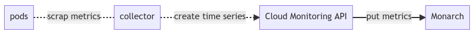
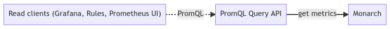

# Google Managed Prometheus Helm Chart

This helm chart generate elements for Google Managed Prometheus:

- Namespace
- PriorityClass
- ClusterRole
- ClusterRoleBinding
- Deployment
- Service
- ServiceAccount
- ConfigMap

### Collecting metrics schema



### Retrieving metrics schema



### Google Managed Prometheus CRDs

Please note that CRDs are not installed through this Chart, they should by installed separately as recommended by Helm Community [Separate Charts](https://helm.sh/docs/chart_best_practices/custom_resource_definitions/#method-2-separate-charts)

Make sure CRDs are already deployed in the target cluster where you want to deploy Google Managed Prometheus engine therefore it will not works !

### Scraping metrics

By default, when the Operator is deployed, it won't collect any metrics even from collector themself.
if you want to monitor collector metrics for example, you should deploy a [PodMonitoring](https://github.com/GoogleCloudPlatform/prometheus-engine/blob/v0.1.1/doc/api.md#podmonitoring) object and target collector pods.

### Deploy an example application

[deploy example application](https://cloud.google.com/stackdriver/docs/managed-prometheus/setup-managed#deploy-app)

### Configure a PodMonitoring resource

[PodMonitoring CR](https://cloud.google.com/stackdriver/docs/managed-prometheus/setup-managed#gmp-pod-monitoring)

Please note that PodMonitoring object should be placed in the namespace where target ressources are currently deployed.
It would take approximately less than 1 minute for seeing your collected metrics into Grafana nor Google Metric Explorer.

### Viewing metrics using GCP

Please find two ways in order to see your metrics using GCP:

* Go to Google Cloud Platform > Monitoring > Managed Prometheus
  * Execute your Prometheus Query to retrieve your metrics
* Go to Google Cloud Platform > Monitoring > Metrics Explorer
  * Select ```Prometheus Target``` as Resource Type than select your requested metrics in the ```Metric``` list
