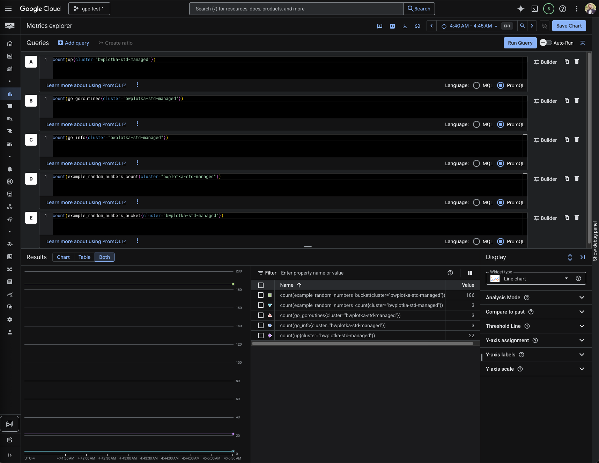
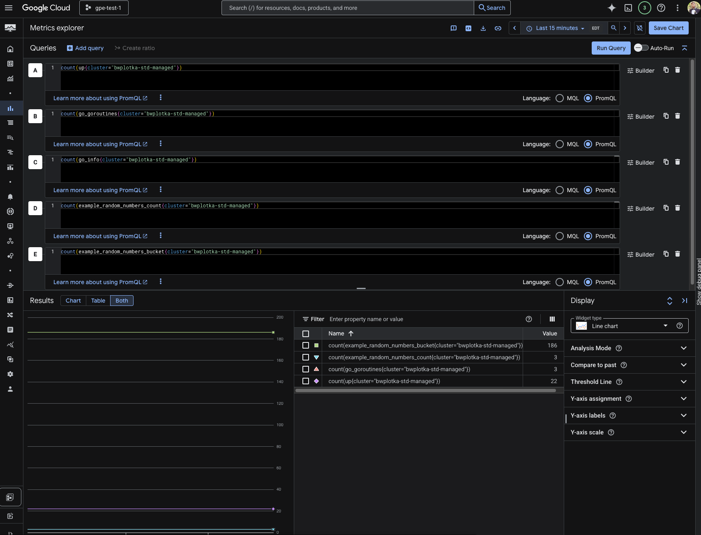

# Target filtering using metricRelabelling

This example shows how to allow list certain metrics for a given metric target.

For this we will use `PodMonitoring` (also available for `ClusterPodMonitoring` and `ClusterNodeMonitoring` CRDs)
[`spec.endpoints[*].metricRelabeling`](../../../doc/api.md#monitoring.googleapis.com/v1.ScrapeEndpoint) field, which
directly maps to [Prometheus `metric_relabel_config` field](https://prometheus.io/docs/prometheus/latest/configuration/configuration/#:~:text=metric%20relabel%20configurations.-,metric_relabel_configs,-%3A%0A%20%20%5B%20%2D%20%3Crelabel_config).

This kind of filtering allows "allow-listing" (`keep` action) or "deny-listing" (`drop` action) on
scrape reducing both collector and GCM side resource usage and cost.

See further documentation in:
* [Google Cloud documentation](https://cloud.google.com/stackdriver/docs/managed-prometheus/setup-managed#filter-metrics)
* [Prometheus relabelling](https://prometheus.io/blog/2015/06/01/advanced-service-discovery/#scrape-configurations-and-relabeling)

See online relabelling validator tool:
* https://relabeler.promlabs.com/

## Example

In this [example](pod-monitoring.yaml) we allow list the following metric for `pod` labels that start with `prom-example-`:

* `go_goroutines` gauge.
* `example_random_number` classic histogram (that consists of `example_random_numbers_bucket`, `example_random_numbers_count`, `example_random_numbers_sum`)

### Steps

1. Clone this repo, change directory to the repo root.
2. Deploy example application:

    ```
    kubectl apply -f ./examples/example-app.yaml
    ```

3. Apply "allow all" `PodMonitoring`:

    ```
    kubectl apply -f ./examples/pod-monitoring.yaml
    ```
    
    After a short time you should see various metrics like `up`, `go_goroutines` `go_info` `example_random_number_bucket`, etc

    

4. Apply `PodMonitoring` with the strict allow list:

    ```
    kubectl apply -f ./examples/configuration/target-filtering/pod-monitoring.yaml
    ```

   After a short time you should see ONLY:
   * Prometheus special metrics (like `up`)
   * Allow listed metrics from `prom-example` app (`go_goroutines` gauge and `example_random_number` classic histogram).
 
   
