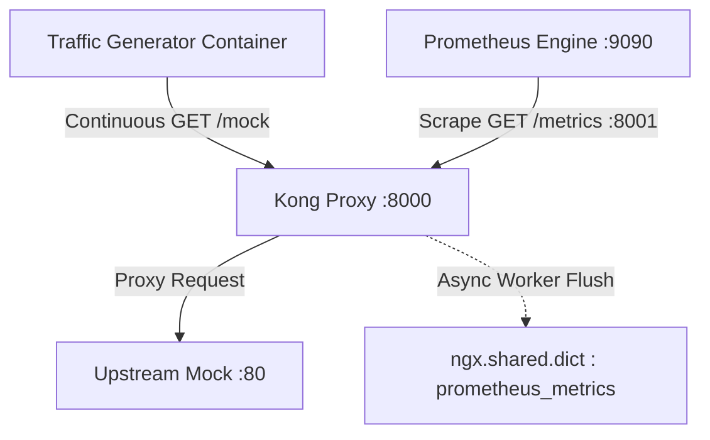

# Kong Proxy & Prometheus Engine Repro Environment

This directory contains a standalone, end-to-end Docker Compose reproduction environment for debugging incident [b/516519320 comment 68](https://b.corp.google.com/issues/516519320#comment68), specifically investigating out-of-order start time errors (`Points must be written in order. One or more of the points specified had an older start time than the most recent point.`) and histogram inconsistencies (`_sum`, `_count`, `_bucket`) when scraping Kong proxy metrics with Google Managed Prometheus (GMP) engine.

## Overview

The self-contained stack includes:
1. **Kong Proxy (v3.6)**: Running in DB-less declarative mode with 1,000 configured services and 1,000 routes (`/mock-1` to `/mock-1000`) and the `prometheus` plugin enabled.
2. **Upstream Mock**: A lightweight mock service (`traefik/whoami`) acting as the backend upstream target for all 1,000 services.
3. **Traffic Generator**: An automated container (`curlimages/curl`) cycling through all 1,000 routes at 100ms intervals to continuously generate latency histograms (`kong_upstream_latency_ms_bucket`, collecting over 20,000 time series).
4. **Prometheus Engine**: Running the official release fork image (`gke.gcr.io/prometheus-engine/prometheus:v2.53.5-gmp.2-gke.0`), configured with a `1d` TSDB storage retention, a `30s` scrape interval, and metric relabeling rules (moving `instance` to `exporter_instance` and setting `instance` to the `service` label name), exporting metrics to GCM project `gpe-test-1` using service account key `~/gmp-test-sa-key.json`.

## Architecture & Data Flow



## Quick Start (End-to-End)

1. **Launch the Stack**:
   Start all services in the background:
   ```bash
   docker compose up -d
   ```

2. **Verify Automatic Traffic Generation**:
   Check logs of the traffic generator to ensure HTTP flow:
   ```bash
   docker compose logs -f traffic-generator
   ```

3. **Inspect Scraped Metrics**:
   Query the live Prometheus web API or UI at port `9090`:
   ```bash
   curl -s 'http://localhost:9090/api/v1/query?query=kong_upstream_latency_ms_count'
   ```

4. **Examine Raw Kong Endpoint**:
   Directly inspect what Kong exposes to the scraper:
   ```bash
   curl -s http://localhost:8001/metrics | grep kong_upstream_latency_ms
   ```

5. **Stop the Stack**:
   ```bash
   docker compose down
   ```

## Root Cause & Investigation Matrix

| Symptom / Error | Root Cause in Kong (`prometheus.lua`) | Impact on GMP / Monarch |
| :--- | :--- | :--- |
| **Missing `_count` series** | Worker tables (`self._counter`) flush asynchronously using non-deterministic `pairs()` iteration. If preempted during scrape, `_sum` or `_bucket` may appear before `_count`. | Scraper receives incomplete histogram distribution. |
| **Decreasing `_sum` / OOO Start Time** | Scrape coroutines yield across dictionary fetches. Asynchronous worker updates between yields can cause `_sum` decrement or mismatch relative to authoritative `_count`. | Monarch rejects point: `Points must be written in order... older start time than most recent point`. |
| **Zero-bucket drops** | LRU eviction on high-cardinality `ngx.shared.dict` evicts individual bucket keys independently. | Dynamic reappearance of buckets causes distribution reset timestamp recalculations. |
| **Observation Reset to 1 / Nil Sum Errors** | Under 1,000 routes cardinality, Kong logs massive key eviction failures (`Error getting 'upstream_latency_ms_sum{...}': nil`), causing `prometheus.lua` to drop partial metrics or emit reset observation counts of 1. | Severe histogram data loss and undercounting across backend services. |
